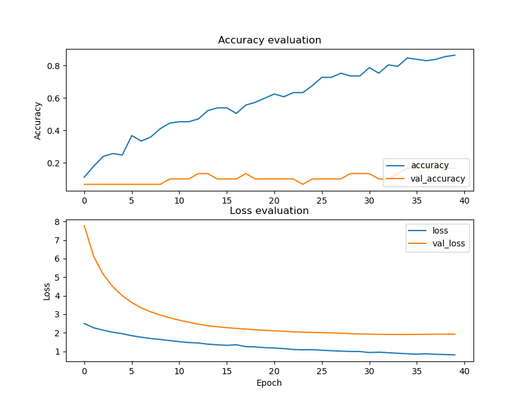

# audio-classification 

audio classification tutorial, make model and deploy model to audio classification program.


## Installation 
- Clone Repository
```bash
  git clone https://github.com/Yumnasilvia/audio-classification.git
```
- Install Tensorflow
- Install Numpy
- Install Matplotlib
- Install Scikit-learn
- Install Librosa

## Create Dataset
- Make dataset folder 
```bash
  cd audio-classification
  mkdir dataset
  cd dataset
  mkdir 'class_name1'
  mkdir 'class_name2'
  mkdir 'class_name3'
```
- Fill class folder with audio file
```bash
  cd 'class_name1' 
  - audio_file.mov
  cd 'class_name2'
  - audio_file.mov
  cd 'class_name3'
  - audio_file.mov
```
- Prepare dataset
```bash
  cd audio-classification
  python prepare_dataset.py
```
## Training Dataset
```bash
  cd audio-classification
  python training_dataset.py
```

## Deploy Model to Testing Program
- Make test folder
```bash
  cd audio-classification
  mkdir test
  - audio_test1.mov
  - audio_test2.mov
```
- Run testing program
```bash
  cd audio-classification
  python testing.py
```
## Authors

- [@Yumnasilvia](https://www.github.com/Yumnasilvia)

